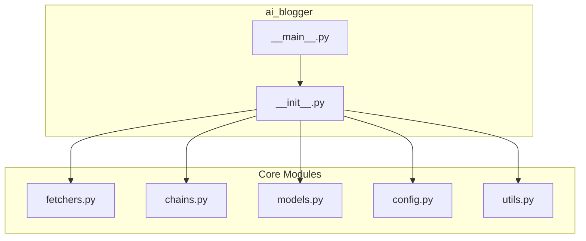

# API Reference

This document provides detailed documentation for the AI Blogger (Inker) Python modules and their public interfaces.

## Module Overview



---

## ai_blogger.models

Pydantic data models for the application.

### Article

Represents a news article or video from various sources.

```python
class Article(BaseModel):
    title: str
    url: HttpUrl
    source: str
    summary: str
    topic: str
    thumbnail: Optional[str] = None
```

**Attributes:**

| Attribute | Type | Description |
|-----------|------|-------------|
| `title` | str | Article title |
| `url` | HttpUrl | Article URL |
| `source` | str | Source identifier (e.g., "hacker_news", "youtube") |
| `summary` | str | Article summary or description |
| `topic` | str | Topic the article was fetched for |
| `thumbnail` | Optional[str] | Thumbnail URL (for videos) |

**Example:**

```python
from ai_blogger.models import Article

article = Article(
    title="New AI Framework Released",
    url="https://example.com/article",
    source="hacker_news",
    summary="A new AI framework...",
    topic="AI software engineering",
)
```

### CandidatePost

Represents a draft blog post candidate.

```python
class CandidatePost(BaseModel):
    title: str
    content: str
    sources: List[str]
    topic: str
```

**Attributes:**

| Attribute | Type | Description |
|-----------|------|-------------|
| `title` | str | Blog post title |
| `content` | str | Full blog post content |
| `sources` | List[str] | URLs of source articles used |
| `topic` | str | Primary topic of the post |

### PostScore

Scoring breakdown for a candidate post.

```python
class PostScore(BaseModel):
    relevance: float
    originality: float
    depth: float
    clarity: float
    engagement: float
    total: float
    reasoning: str
```

**Attributes:**

| Attribute | Type | Description |
|-----------|------|-------------|
| `relevance` | float | Relevance score (0-10) |
| `originality` | float | Originality score (0-10) |
| `depth` | float | Depth score (0-10) |
| `clarity` | float | Clarity score (0-10) |
| `engagement` | float | Engagement score (0-10) |
| `total` | float | Weighted total score |
| `reasoning` | str | Explanation of the scores |

### ScoredPost

A candidate post with its score.

```python
class ScoredPost(BaseModel):
    candidate: CandidatePost
    score: PostScore
```

---

## ai_blogger.fetchers

Modular fetcher architecture for news sources.

### BaseFetcher

Abstract base class for all fetchers.

```python
class BaseFetcher(ABC):
    name: str = ""
    env_key: Optional[str] = None
    description: str = ""
    
    def is_available(self) -> bool: ...
    def get_missing_key_message(self) -> str: ...
    def _validate_inputs(self, topic: str, max_results: int) -> None: ...
    
    @abstractmethod
    def fetch(self, topic: str, max_results: int) -> List[Article]: ...
```

**Methods:**

#### is_available()

Check if this fetcher is available (has required API key).

```python
def is_available(self) -> bool
```

**Returns:** `True` if fetcher can be used, `False` otherwise.

#### fetch()

Fetch articles for a given topic.

```python
@abstractmethod
def fetch(self, topic: str, max_results: int) -> List[Article]
```

**Args:**

- `topic` (str): The topic to search for (must not be empty)
- `max_results` (int): Maximum number of results (must be positive)

**Returns:** List of `Article` objects.

**Raises:** `ValueError` if inputs are invalid.

### HackerNewsFetcher

Fetcher for Hacker News articles via Algolia API.

```python
@register_fetcher("hacker_news")
class HackerNewsFetcher(BaseFetcher):
    name = "hacker_news"
    env_key = None
    description = "Fetch articles from Hacker News"
```

No API key required.

### WebSearchFetcher

Fetcher for web search results via Tavily API.

```python
@register_fetcher("web")
class WebSearchFetcher(BaseFetcher):
    name = "web"
    env_key = "TAVILY_API_KEY"
    description = "Fetch articles from web search (Tavily)"
```

Requires `TAVILY_API_KEY` environment variable.

### YouTubeFetcher

Fetcher for trending YouTube videos via YouTube Data API v3.

```python
@register_fetcher("youtube")
class YouTubeFetcher(BaseFetcher):
    name = "youtube"
    env_key = "YOUTUBE_API_KEY"
    description = "Fetch trending YouTube videos"
```

Requires `YOUTUBE_API_KEY` environment variable.

### register_fetcher()

Decorator to register a fetcher class.

```python
def register_fetcher(name: str) -> Callable[[Type[BaseFetcher]], Type[BaseFetcher]]
```

**Args:**

- `name` (str): The unique identifier for this fetcher

**Example:**

```python
@register_fetcher("my_source")
class MySourceFetcher(BaseFetcher):
    ...
```

### get_available_sources()

Get list of all registered source names.

```python
def get_available_sources() -> List[str]
```

**Returns:** List of registered fetcher names.

### get_fetcher()

Get a fetcher instance by name.

```python
def get_fetcher(name: str) -> Optional[BaseFetcher]
```

**Args:**

- `name` (str): The fetcher name to retrieve

**Returns:** Fetcher instance or `None` if not found.

### fetch_all_articles()

Fetch articles from specified sources for the given topics.

```python
def fetch_all_articles(
    topics: Optional[List[str]] = None,
    sources: Optional[List[str]] = None,
    max_results: Optional[Dict[str, int]] = None,
) -> List[Article]
```

**Args:**

- `topics` (Optional[List[str]]): List of topics to search for. Defaults to config topics.
- `sources` (Optional[List[str]]): List of source names. Defaults to all sources.
- `max_results` (Optional[Dict[str, int]]): Dict mapping source names to max results.

**Returns:** Combined list of `Article` objects from all sources.

---

## ai_blogger.chains

LangChain chains for content generation, scoring, and refinement.

### get_llm()

Get a configured LLM instance.

```python
def get_llm(temperature: float = 0.7) -> ChatOpenAI
```

**Args:**

- `temperature` (float): The temperature setting for the LLM

**Returns:** Configured `ChatOpenAI` instance.

### generate_candidates()

Generate candidate blog posts from articles.

```python
def generate_candidates(
    articles: List[Article],
    num_candidates: int = DEFAULT_NUM_CANDIDATES
) -> List[CandidatePost]
```

**Args:**

- `articles` (List[Article]): List of Article objects to use as sources
- `num_candidates` (int): Number of candidate posts to generate

**Returns:** List of `CandidatePost` objects.

**Raises:** `ValueError` if parsing fails.

### score_candidate()

Score a candidate blog post.

```python
def score_candidate(candidate: CandidatePost) -> ScoredPost
```

**Args:**

- `candidate` (CandidatePost): The CandidatePost to score

**Returns:** `ScoredPost` with scoring breakdown.

### score_candidates()

Score all candidate posts.

```python
def score_candidates(candidates: List[CandidatePost]) -> List[ScoredPost]
```

**Args:**

- `candidates` (List[CandidatePost]): List of CandidatePost objects to score

**Returns:** List of `ScoredPost` objects, sorted by total score (descending).

### refine_winner()

Refine and polish the winning blog post.

```python
def refine_winner(winner: ScoredPost) -> str
```

**Args:**

- `winner` (ScoredPost): The winning ScoredPost to refine

**Returns:** The refined blog post content as Markdown.

---

## ai_blogger.config

Configuration settings for the application.

### Constants

| Constant | Type | Default | Description |
|----------|------|---------|-------------|
| `TOPICS` | List[str] | See below | Default search topics |
| `SCORING_WEIGHTS` | Dict[str, float] | See below | Scoring criteria weights |
| `WEIGHTS_TOLERANCE` | float | 0.001 | Floating-point tolerance |
| `YOUTUBE_MAX_AGE_DAYS` | int | 7 | Max age for YouTube videos |
| `DEFAULT_MAX_RESULTS` | int | 5 | Default results per source |
| `SOURCE_DEFAULTS` | Dict[str, int] | See below | Per-source result counts |
| `DEFAULT_NUM_CANDIDATES` | int | 3 | Number of candidates |
| `DEFAULT_OUTPUT_DIR` | str | "./posts" | Output directory |
| `LLM_MODEL_NAME` | str | "gpt-4" | OpenAI model name |

### Default Topics

```python
TOPICS = [
    "AI software engineering",
    "agentic AI development",
    "Copilot coding assistants",
    "developer productivity",
    "software engineering leadership",
    "cybersecurity",
    "AI security",
    "dev tools",
    "cloud infrastructure",
]
```

### Scoring Weights

```python
SCORING_WEIGHTS = {
    "relevance": 0.3,
    "originality": 0.25,
    "depth": 0.2,
    "clarity": 0.15,
    "engagement": 0.1,
}
```

### Source Defaults

```python
SOURCE_DEFAULTS = {
    "hacker_news": 10,
    "web": 5,
    "youtube": 5,
}
```

---

## ai_blogger.utils

Utility functions.

### slugify()

Convert text to a URL-friendly slug.

```python
def slugify(text: str, max_length: int = 100) -> str
```

**Args:**

- `text` (str): The text to convert
- `max_length` (int): Maximum length of the slug

**Returns:** A URL-friendly slug version of the text.

**Example:**

```python
>>> slugify("Hello World! 123")
'hello-world-123'
```

### get_timestamp()

Get the current timestamp in ISO format.

```python
def get_timestamp() -> str
```

**Returns:** Current timestamp as a string.

### get_date_string()

Get the current date as a string for filenames.

```python
def get_date_string() -> str
```

**Returns:** Current date in `YYYY-MM-DD` format.

### generate_filename()

Generate a filename for a blog post.

```python
def generate_filename(title: str) -> str
```

**Args:**

- `title` (str): The title of the blog post

**Returns:** A filename in the format `YYYY-MM-DD-slug.md`.

**Example:**

```python
>>> generate_filename("My Blog Post Title")
'2024-01-15-my-blog-post-title.md'
```

---

## Package Exports

The main `ai_blogger` package exports the following:

```python
from ai_blogger import (
    # Configuration
    TOPICS,
    
    # Models
    Article,
    CandidatePost,
    PostScore,
    ScoredPost,
    
    # Job Models (Phase 2)
    BlogPostJob,
    JobStatus,
    ApprovalStatus,
    JobSubmission,
    JobResponse,
    JobPreview,
    ApprovalRequest,
    ApprovalRecord,
    EditorComment,
    JobStats,
    HistoricalJobsResponse,
    
    # Fetchers
    BaseFetcher,
    register_fetcher,
    get_available_sources,
    get_fetcher,
    fetch_all_articles,
    
    # Utilities
    slugify,
    get_timestamp,
    get_date_string,
    generate_filename,
)
```

---

## ai_blogger.job_models (Phase 2)

Data models for the job management and approval workflow.

### JobStatus

Status of a blog post generation job.

```python
class JobStatus(str, Enum):
    PENDING = "pending"
    IN_PROGRESS = "in_progress"
    COMPLETED = "completed"
    NEEDS_APPROVAL = "needs_approval"
    APPROVED = "approved"
    REJECTED = "rejected"
    FAILED = "failed"
```

### ApprovalStatus

Status of editorial approval.

```python
class ApprovalStatus(str, Enum):
    PENDING = "pending"
    APPROVED = "approved"
    REJECTED = "rejected"
```

### BlogPostJob

A job for generating a blog post.

```python
class BlogPostJob(BaseModel):
    id: UUID
    correlation_id: Optional[str]
    status: JobStatus
    topics: List[str]
    sources: List[str]
    num_candidates: int
    created_at: datetime
    updated_at: datetime
    started_at: Optional[datetime]
    completed_at: Optional[datetime]
    error_message: Optional[str]
    title: Optional[str]
    content: Optional[str]
    score: Optional[float]
    sources_used: List[str]
    approval_status: ApprovalStatus
    approval_records: List[ApprovalRecord]
```

### JobSubmission

Request model for submitting a new blog post job.

```python
class JobSubmission(BaseModel):
    topics: Optional[List[str]]
    sources: Optional[List[str]]
    num_candidates: int = 3
    correlation_id: Optional[str]
```

### ApprovalRequest

Request model for approving or rejecting a blog post.

```python
class ApprovalRequest(BaseModel):
    status: ApprovalStatus
    reviewer: str
    reason: Optional[str]
    comments: Optional[List[str]]
```

### EditorComment

An editor comment on a blog post.

```python
class EditorComment(BaseModel):
    id: UUID
    job_id: UUID
    author: str
    content: str
    created_at: datetime
```

---

## ai_blogger.api (Phase 2)

RESTful API for job management and approval workflow.

### Endpoints

| Method | Path | Description |
|--------|------|-------------|
| POST | `/api/v1/jobs` | Submit a new blog post job |
| GET | `/api/v1/jobs/{job_id}` | Get job status |
| GET | `/api/v1/jobs/{job_id}/preview` | Preview generated content |
| POST | `/api/v1/jobs/{job_id}/approve` | Approve or reject a blog post |
| GET | `/api/v1/jobs/{job_id}/comments` | Get job comments |
| POST | `/api/v1/jobs/{job_id}/comments` | Add a comment |
| GET | `/api/v1/jobs` | List jobs with filtering |
| GET | `/api/v1/stats` | Get job statistics |
| GET | `/api/v1/health` | Health check |
| GET | `/api/v1/ready` | Readiness check |
| GET | `/metrics` | Prometheus metrics |

### Running the API Server

```bash
# Basic usage
python -m ai_blogger.server

# Custom host and port
python -m ai_blogger.server --host 0.0.0.0 --port 8080

# Development mode with auto-reload
python -m ai_blogger.server --reload

# Using uvicorn directly
uvicorn ai_blogger.api.app:create_app --factory --host 0.0.0.0 --port 8000
```

### OpenAPI Documentation

When the server is running, interactive API documentation is available at:
- Swagger UI: `http://localhost:8000/docs`
- ReDoc: `http://localhost:8000/redoc`
- OpenAPI JSON: `http://localhost:8000/openapi.json`

## See Also

- [Architecture](architecture.md) - System design overview
- [Developer Guide](developer-guide.md) - Extension guide
- [Operations](operations.md) - Deployment guide
