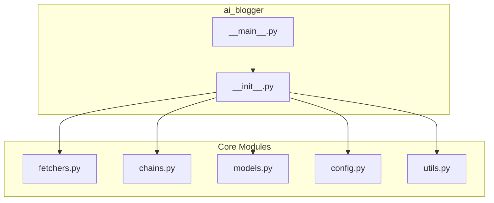

# API Reference

This document provides detailed documentation for the AI Blogger (Inker) Python modules and their public interfaces.

## Module Overview



---

## ai_blogger.models

Pydantic data models for the application.

### Article

Represents a news article or video from various sources.

```python
class Article(BaseModel):
    title: str
    url: HttpUrl
    source: str
    summary: str
    topic: str
    thumbnail: Optional[str] = None
```

**Attributes:**

| Attribute | Type | Description |
|-----------|------|-------------|
| `title` | str | Article title |
| `url` | HttpUrl | Article URL |
| `source` | str | Source identifier (e.g., "hacker_news", "youtube") |
| `summary` | str | Article summary or description |
| `topic` | str | Topic the article was fetched for |
| `thumbnail` | Optional[str] | Thumbnail URL (for videos) |

**Example:**

```python
from ai_blogger.models import Article

article = Article(
    title="New AI Framework Released",
    url="https://example.com/article",
    source="hacker_news",
    summary="A new AI framework...",
    topic="AI software engineering",
)
```

### CandidatePost

Represents a draft blog post candidate.

```python
class CandidatePost(BaseModel):
    title: str
    content: str
    sources: List[str]
    topic: str
```

**Attributes:**

| Attribute | Type | Description |
|-----------|------|-------------|
| `title` | str | Blog post title |
| `content` | str | Full blog post content |
| `sources` | List[str] | URLs of source articles used |
| `topic` | str | Primary topic of the post |

### PostScore

Scoring breakdown for a candidate post.

```python
class PostScore(BaseModel):
    relevance: float
    originality: float
    depth: float
    clarity: float
    engagement: float
    total: float
    reasoning: str
```

**Attributes:**

| Attribute | Type | Description |
|-----------|------|-------------|
| `relevance` | float | Relevance score (0-10) |
| `originality` | float | Originality score (0-10) |
| `depth` | float | Depth score (0-10) |
| `clarity` | float | Clarity score (0-10) |
| `engagement` | float | Engagement score (0-10) |
| `total` | float | Weighted total score |
| `reasoning` | str | Explanation of the scores |

### ScoredPost

A candidate post with its score.

```python
class ScoredPost(BaseModel):
    candidate: CandidatePost
    score: PostScore
```

---

## ai_blogger.fetchers

Modular fetcher architecture for news sources.

### BaseFetcher

Abstract base class for all fetchers.

```python
class BaseFetcher(ABC):
    name: str = ""
    env_key: Optional[str] = None
    description: str = ""
    
    def is_available(self) -> bool: ...
    def get_missing_key_message(self) -> str: ...
    def _validate_inputs(self, topic: str, max_results: int) -> None: ...
    
    @abstractmethod
    def fetch(self, topic: str, max_results: int) -> List[Article]: ...
```

**Methods:**

#### is_available()

Check if this fetcher is available (has required API key).

```python
def is_available(self) -> bool
```

**Returns:** `True` if fetcher can be used, `False` otherwise.

#### fetch()

Fetch articles for a given topic.

```python
@abstractmethod
def fetch(self, topic: str, max_results: int) -> List[Article]
```

**Args:**

- `topic` (str): The topic to search for (must not be empty)
- `max_results` (int): Maximum number of results (must be positive)

**Returns:** List of `Article` objects.

**Raises:** `ValueError` if inputs are invalid.

### HackerNewsFetcher

Fetcher for Hacker News articles via Algolia API.

```python
@register_fetcher("hacker_news")
class HackerNewsFetcher(BaseFetcher):
    name = "hacker_news"
    env_key = None
    description = "Fetch articles from Hacker News"
```

No API key required.

### WebSearchFetcher

Fetcher for web search results via Tavily API.

```python
@register_fetcher("web")
class WebSearchFetcher(BaseFetcher):
    name = "web"
    env_key = "TAVILY_API_KEY"
    description = "Fetch articles from web search (Tavily)"
```

Requires `TAVILY_API_KEY` environment variable.

### YouTubeFetcher

Fetcher for trending YouTube videos via YouTube Data API v3.

```python
@register_fetcher("youtube")
class YouTubeFetcher(BaseFetcher):
    name = "youtube"
    env_key = "YOUTUBE_API_KEY"
    description = "Fetch trending YouTube videos"
```

Requires `YOUTUBE_API_KEY` environment variable.

### register_fetcher()

Decorator to register a fetcher class.

```python
def register_fetcher(name: str) -> Callable[[Type[BaseFetcher]], Type[BaseFetcher]]
```

**Args:**

- `name` (str): The unique identifier for this fetcher

**Example:**

```python
@register_fetcher("my_source")
class MySourceFetcher(BaseFetcher):
    ...
```

### get_available_sources()

Get list of all registered source names.

```python
def get_available_sources() -> List[str]
```

**Returns:** List of registered fetcher names.

### get_fetcher()

Get a fetcher instance by name.

```python
def get_fetcher(name: str) -> Optional[BaseFetcher]
```

**Args:**

- `name` (str): The fetcher name to retrieve

**Returns:** Fetcher instance or `None` if not found.

### fetch_all_articles()

Fetch articles from specified sources for the given topics.

```python
def fetch_all_articles(
    topics: Optional[List[str]] = None,
    sources: Optional[List[str]] = None,
    max_results: Optional[Dict[str, int]] = None,
) -> List[Article]
```

**Args:**

- `topics` (Optional[List[str]]): List of topics to search for. Defaults to config topics.
- `sources` (Optional[List[str]]): List of source names. Defaults to all sources.
- `max_results` (Optional[Dict[str, int]]): Dict mapping source names to max results.

**Returns:** Combined list of `Article` objects from all sources.

---

## ai_blogger.chains

LangChain chains for content generation, scoring, and refinement.

### get_llm()

Get a configured LLM instance.

```python
def get_llm(temperature: float = 0.7) -> ChatOpenAI
```

**Args:**

- `temperature` (float): The temperature setting for the LLM

**Returns:** Configured `ChatOpenAI` instance.

### generate_candidates()

Generate candidate blog posts from articles.

```python
def generate_candidates(
    articles: List[Article],
    num_candidates: int = DEFAULT_NUM_CANDIDATES
) -> List[CandidatePost]
```

**Args:**

- `articles` (List[Article]): List of Article objects to use as sources
- `num_candidates` (int): Number of candidate posts to generate

**Returns:** List of `CandidatePost` objects.

**Raises:** `ValueError` if parsing fails.

### score_candidate()

Score a candidate blog post.

```python
def score_candidate(candidate: CandidatePost) -> ScoredPost
```

**Args:**

- `candidate` (CandidatePost): The CandidatePost to score

**Returns:** `ScoredPost` with scoring breakdown.

### score_candidates()

Score all candidate posts.

```python
def score_candidates(candidates: List[CandidatePost]) -> List[ScoredPost]
```

**Args:**

- `candidates` (List[CandidatePost]): List of CandidatePost objects to score

**Returns:** List of `ScoredPost` objects, sorted by total score (descending).

### refine_winner()

Refine and polish the winning blog post.

```python
def refine_winner(winner: ScoredPost) -> str
```

**Args:**

- `winner` (ScoredPost): The winning ScoredPost to refine

**Returns:** The refined blog post content as Markdown.

---

## ai_blogger.config

Configuration settings for the application.

### Constants

| Constant | Type | Default | Description |
|----------|------|---------|-------------|
| `TOPICS` | List[str] | See below | Default search topics |
| `SCORING_WEIGHTS` | Dict[str, float] | See below | Scoring criteria weights |
| `WEIGHTS_TOLERANCE` | float | 0.001 | Floating-point tolerance |
| `YOUTUBE_MAX_AGE_DAYS` | int | 7 | Max age for YouTube videos |
| `DEFAULT_MAX_RESULTS` | int | 5 | Default results per source |
| `SOURCE_DEFAULTS` | Dict[str, int] | See below | Per-source result counts |
| `DEFAULT_NUM_CANDIDATES` | int | 3 | Number of candidates |
| `DEFAULT_OUTPUT_DIR` | str | "./posts" | Output directory |
| `LLM_MODEL_NAME` | str | "gpt-4" | OpenAI model name |

### Default Topics

```python
TOPICS = [
    "AI software engineering",
    "agentic AI development",
    "Copilot coding assistants",
    "developer productivity",
    "software engineering leadership",
    "cybersecurity",
    "AI security",
    "dev tools",
    "cloud infrastructure",
]
```

### Scoring Weights

```python
SCORING_WEIGHTS = {
    "relevance": 0.3,
    "originality": 0.25,
    "depth": 0.2,
    "clarity": 0.15,
    "engagement": 0.1,
}
```

### Source Defaults

```python
SOURCE_DEFAULTS = {
    "hacker_news": 10,
    "web": 5,
    "youtube": 5,
}
```

---

## ai_blogger.utils

Utility functions.

### slugify()

Convert text to a URL-friendly slug.

```python
def slugify(text: str, max_length: int = 100) -> str
```

**Args:**

- `text` (str): The text to convert
- `max_length` (int): Maximum length of the slug

**Returns:** A URL-friendly slug version of the text.

**Example:**

```python
>>> slugify("Hello World! 123")
'hello-world-123'
```

### get_timestamp()

Get the current timestamp in ISO format.

```python
def get_timestamp() -> str
```

**Returns:** Current timestamp as a string.

### get_date_string()

Get the current date as a string for filenames.

```python
def get_date_string() -> str
```

**Returns:** Current date in `YYYY-MM-DD` format.

### generate_filename()

Generate a filename for a blog post.

```python
def generate_filename(title: str) -> str
```

**Args:**

- `title` (str): The title of the blog post

**Returns:** A filename in the format `YYYY-MM-DD-slug.md`.

**Example:**

```python
>>> generate_filename("My Blog Post Title")
'2024-01-15-my-blog-post-title.md'
```

---

## Package Exports

The main `ai_blogger` package exports the following:

```python
from ai_blogger import (
    # Configuration
    TOPICS,
    
    # Models
    Article,
    CandidatePost,
    PostScore,
    ScoredPost,
    
    # Fetchers
    BaseFetcher,
    register_fetcher,
    get_available_sources,
    get_fetcher,
    fetch_all_articles,
    
    # Feedback API
    FeedbackService,
    ApprovalRequest,
    RejectionRequest,
    RevisionRequest,
    FeedbackCategory,
    FeedbackRating,
    FeedbackEntry,
    FeedbackStats,
    FeedbackResponse,
    
    # Utilities
    slugify,
    get_timestamp,
    get_date_string,
    generate_filename,
)
```

---

## ai_blogger.feedback_api

The Feedback API provides structured endpoints for blog post approval, rejection, and editorial feedback. It is designed to support learning from editorial outcomes.

### FeedbackService

Service for managing blog post feedback and approvals.

```python
class FeedbackService:
    def __init__(self, storage: StorageBackend):
        """Initialize with a storage backend."""
        
    def approve_post(self, request: ApprovalRequest) -> FeedbackResponse: ...
    def reject_post(self, request: RejectionRequest) -> FeedbackResponse: ...
    def request_revision(self, request: RevisionRequest) -> FeedbackResponse: ...
    def get_post_feedback(self, post_id: str) -> List[FeedbackEntry]: ...
    def get_feedback_stats(self) -> FeedbackStats: ...
    def get_learning_data(self, limit: int = 100) -> List[dict]: ...
```

**Example:**

```python
from ai_blogger import FeedbackService, ApprovalRequest, create_storage

storage = create_storage()
feedback_service = FeedbackService(storage)

# Approve a post
response = feedback_service.approve_post(ApprovalRequest(
    post_id="post-123",
    feedback="Excellent content!",
    actor="reviewer-1",
))
print(f"Post approved: {response.success}")
```

### ApprovalRequest

Request to approve a blog post.

```python
class ApprovalRequest(BaseModel):
    post_id: str
    feedback: Optional[str] = None
    ratings: List[FeedbackRating] = []
    actor: Optional[str] = None
```

### RejectionRequest

Request to reject a blog post. Feedback is required.

```python
class RejectionRequest(BaseModel):
    post_id: str
    feedback: str  # Required
    categories: List[FeedbackCategory] = []
    ratings: List[FeedbackRating] = []
    actor: Optional[str] = None
```

### RevisionRequest

Request revision for a blog post. Feedback is required.

```python
class RevisionRequest(BaseModel):
    post_id: str
    feedback: str  # Required
    categories: List[FeedbackCategory] = []
    ratings: List[FeedbackRating] = []
    actor: Optional[str] = None
```

### FeedbackCategory

Categories for classifying editorial feedback.

| Category | Value | Description |
|----------|-------|-------------|
| QUALITY | "quality" | Overall quality issues |
| RELEVANCE | "relevance" | Topic/content relevance |
| ACCURACY | "accuracy" | Factual accuracy concerns |
| CLARITY | "clarity" | Writing clarity issues |
| ENGAGEMENT | "engagement" | Reader engagement concerns |
| LENGTH | "length" | Content length issues |
| STYLE | "style" | Writing style feedback |
| SOURCES | "sources" | Source quality/citation issues |
| OTHER | "other" | Miscellaneous feedback |

### FeedbackRating

Structured rating for a specific aspect of a blog post.

```python
class FeedbackRating(BaseModel):
    category: FeedbackCategory
    score: int  # 1-5 scale (1=poor, 5=excellent)
    comment: Optional[str] = None
```

**Example:**

```python
from ai_blogger import FeedbackRating, FeedbackCategory

rating = FeedbackRating(
    category=FeedbackCategory.QUALITY,
    score=4,
    comment="Good overall quality, minor improvements needed",
)
```

### FeedbackEntry

A feedback entry capturing editorial input for learning.

```python
class FeedbackEntry(BaseModel):
    id: str
    post_id: str
    job_id: Optional[str] = None
    action: str  # "approved", "rejected", "revision_requested"
    feedback: Optional[str] = None
    categories: List[FeedbackCategory] = []
    ratings: List[FeedbackRating] = []
    actor: Optional[str] = None
    post_scoring: Optional[Dict[str, Any]] = None
    post_topic: Optional[str] = None
    post_word_count: Optional[int] = None
    created_at: datetime
```

### FeedbackStats

Aggregated feedback statistics for learning.

```python
class FeedbackStats(BaseModel):
    total_feedback: int = 0
    approvals: int = 0
    rejections: int = 0
    revisions: int = 0
    approval_rate: Optional[float] = None
    avg_quality_score: Optional[float] = None
    avg_relevance_score: Optional[float] = None
    avg_clarity_score: Optional[float] = None
    avg_engagement_score: Optional[float] = None
    common_rejection_categories: List[str] = []
    avg_time_to_decision_hours: Optional[float] = None
    feedback_by_topic: Dict[str, Dict[str, Any]] = {}
```

### FeedbackResponse

Response after providing feedback on a blog post.

```python
class FeedbackResponse(BaseModel):
    success: bool
    post_id: str
    new_status: str
    feedback_id: str
    message: str
```

---

## Feedback Learning System

The Feedback API is designed to support learning from editorial outcomes. The `get_learning_data()` method returns structured data suitable for training or refining content generation algorithms.

```python
from ai_blogger import FeedbackService, create_storage

storage = create_storage()
feedback_service = FeedbackService(storage)

# Get learning data from past decisions
learning_data = feedback_service.get_learning_data(limit=100)

for entry in learning_data:
    print(f"Post: {entry['title']}")
    print(f"Topic: {entry['topic']}")
    print(f"Outcome: {entry['outcome']}")  # 'approved' or 'rejected'
    print(f"Feedback: {entry['feedback']}")
    print(f"Scoring: {entry['scoring']}")
    print("---")
```

### Future Feedback-Based Ranking

The feedback data can be used to:

1. **Train ranking models**: Use approval/rejection patterns to improve candidate scoring
2. **Topic preference learning**: Identify which topics have higher approval rates
3. **Content style optimization**: Learn from feedback categories to improve content generation
4. **Reviewer calibration**: Track reviewer patterns for consistency

## See Also

- [Architecture](architecture.md) - System design overview
- [Developer Guide](developer-guide.md) - Extension guide
- [Operations](operations.md) - Deployment guide
- [Persistence](persistence.md) - Storage layer documentation
