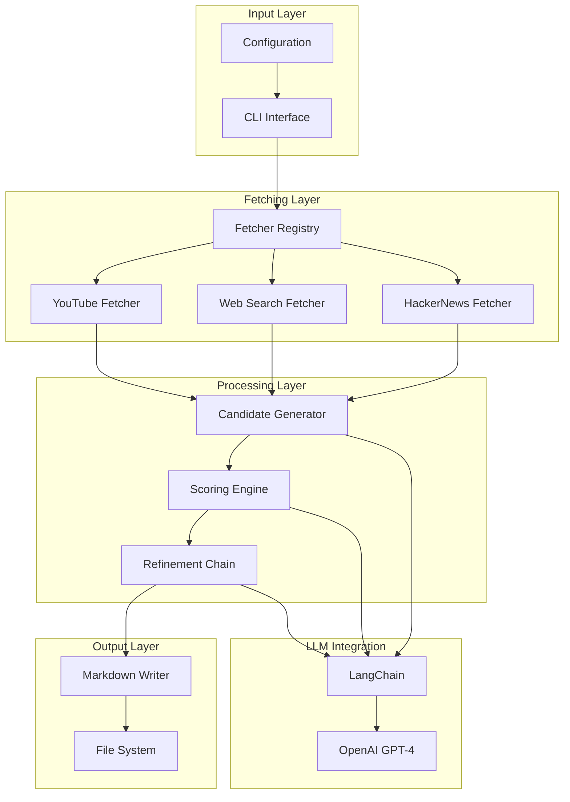
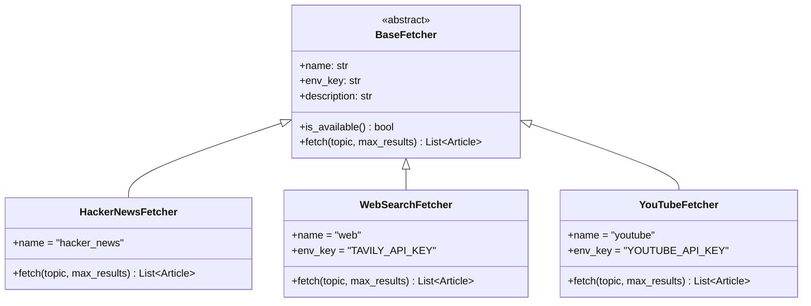
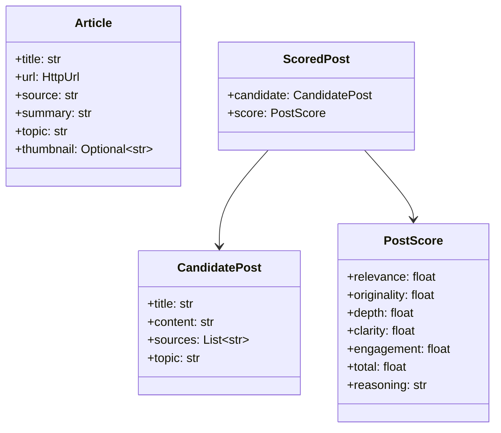
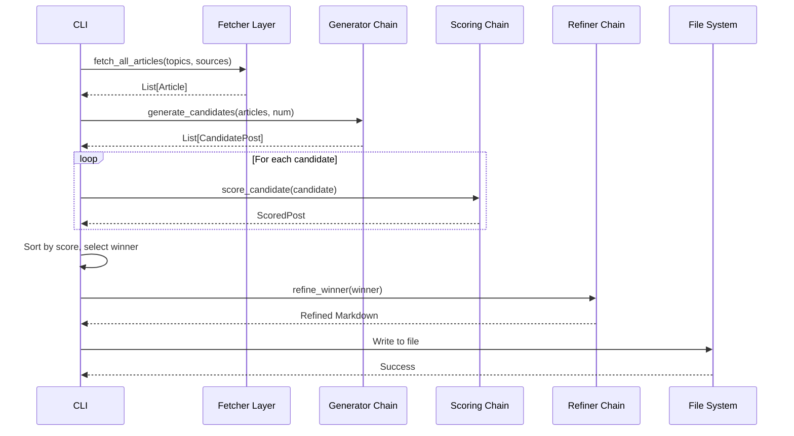
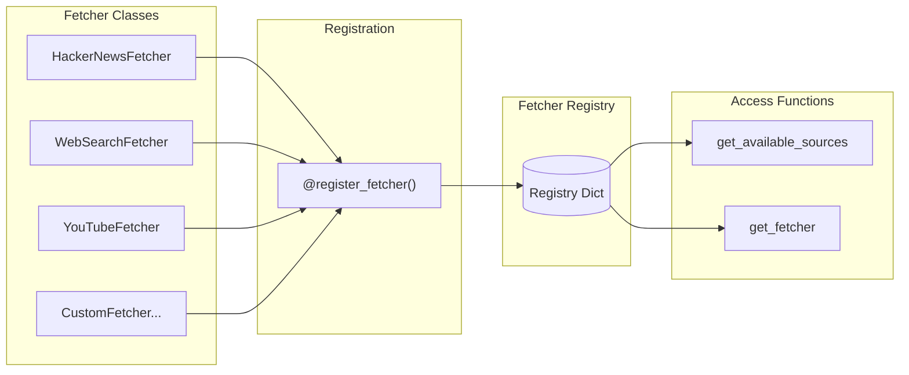
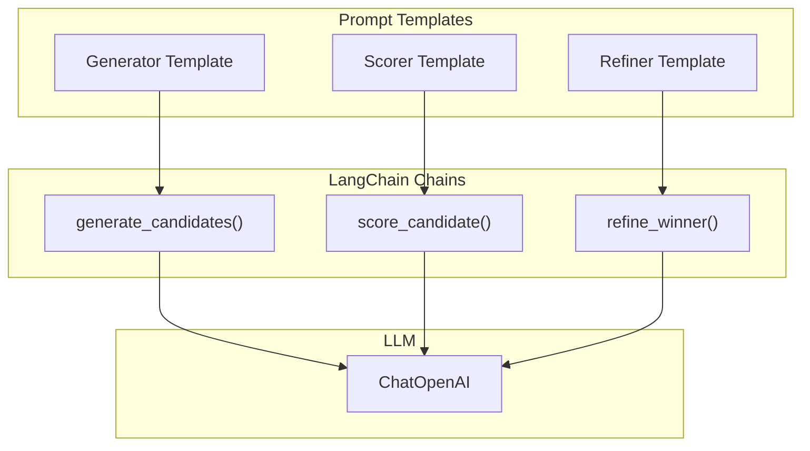
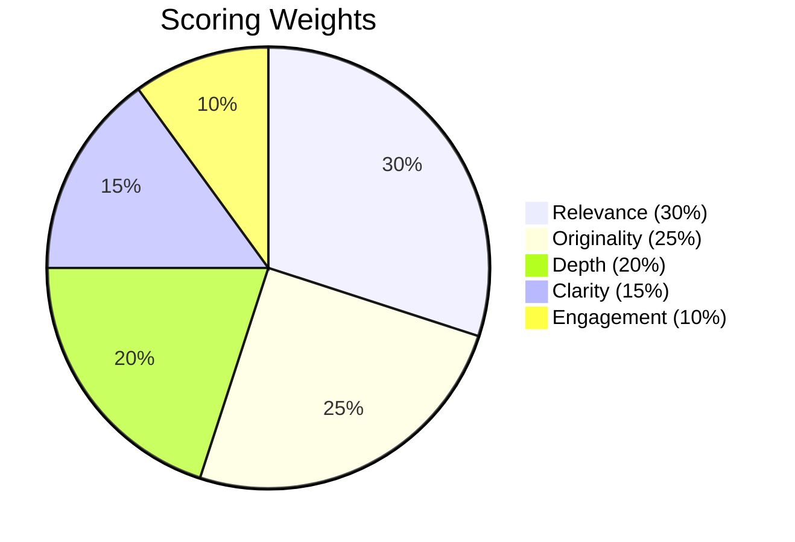
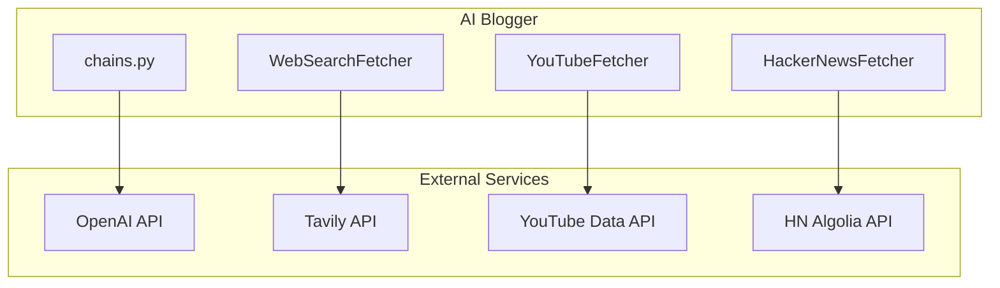
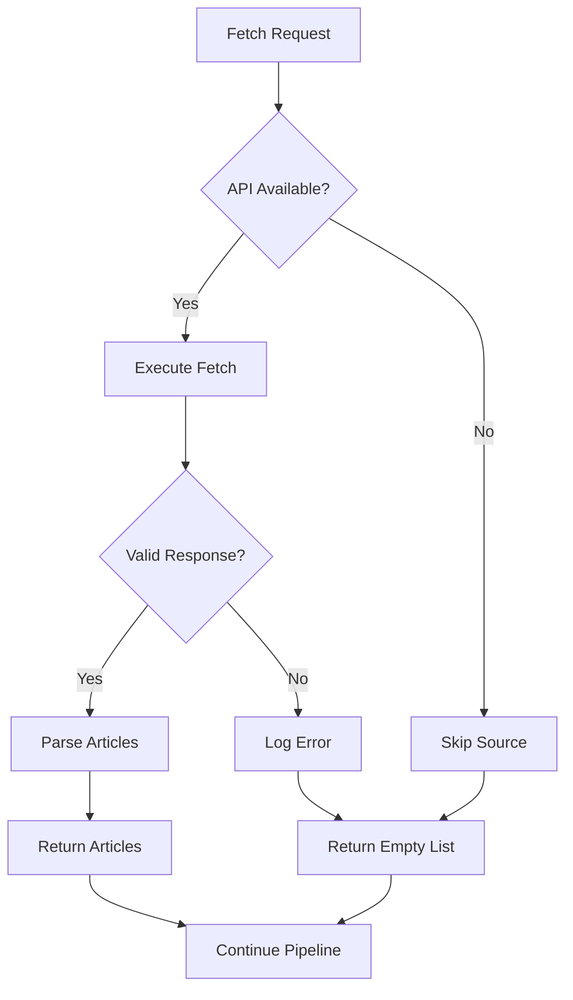

# Architecture

This document provides an overview of the AI Blogger (Inker) system architecture, including component design, data flow, and integration patterns.

## System Overview

AI Blogger follows a modular pipeline architecture that separates concerns into distinct phases:



## Component Architecture

### Core Components



### Data Models



## Pipeline Flow

The content generation pipeline follows these sequential phases:



## Fetcher Architecture

The fetcher subsystem uses a registry pattern for extensibility:



### Adding a New Fetcher

```python
from ai_blogger.fetchers import BaseFetcher, register_fetcher

@register_fetcher("my_source")
class MySourceFetcher(BaseFetcher):
    name = "my_source"
    env_key = "MY_SOURCE_API_KEY"  # Optional
    description = "Fetch from My Source"
    
    def fetch(self, topic: str, max_results: int) -> List[Article]:
        self._validate_inputs(topic, max_results)
        # Implementation here
        return articles
```

## LangChain Integration

AI Blogger uses LangChain for all LLM interactions:



### Chain Configuration

| Chain | Temperature | Purpose |
|-------|-------------|---------|
| Generator | 0.8 | Creative content generation |
| Scorer | 0.3 | Consistent, objective scoring |
| Refiner | 0.6 | Balanced refinement |

## Scoring System

The scoring system uses weighted criteria:



### Scoring Criteria

| Criterion | Weight | Description |
|-----------|--------|-------------|
| Relevance | 0.30 | Topic relevance to software engineering |
| Originality | 0.25 | Unique perspective and insights |
| Depth | 0.20 | Thoroughness of exploration |
| Clarity | 0.15 | Writing quality and structure |
| Engagement | 0.10 | Reader attention capture |

## Directory Structure

```
ai_blogger/
├── __init__.py       # Package exports
├── __main__.py       # CLI entrypoint
├── config.py         # Configuration settings
├── fetchers.py       # Modular fetcher architecture
├── chains.py         # LangChain chains
├── models.py         # Pydantic data models
└── utils.py          # Utility functions
```

## External Dependencies



### API Usage Notes

| API | Authentication | Rate Limits |
|-----|---------------|-------------|
| OpenAI | API Key | Per-minute/per-day based on tier |
| Tavily | API Key | Plan-dependent |
| YouTube Data API | API Key | 10,000 units/day default |
| HN Algolia | None | Reasonable use |

## Error Handling

The system implements graceful degradation:



## See Also

- [Developer Guide](developer-guide.md) - Extending the system
- [API Reference](api-reference.md) - Detailed module documentation
- [Operations](operations.md) - Deployment and monitoring
