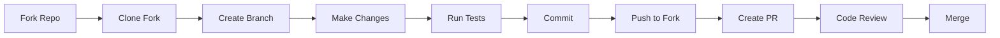

# Contributing

Thank you for your interest in contributing to AI Blogger (Inker)! This guide will help you get started.

## Ways to Contribute

- 🐛 **Report bugs** - Submit issues for bugs you find
- 💡 **Suggest features** - Propose new features or enhancements
- 📝 **Improve documentation** - Fix typos, clarify explanations
- 🔧 **Submit code** - Fix bugs or implement features
- 🧪 **Add tests** - Improve test coverage

## Development Workflow



## Getting Started

### 1. Fork and Clone

```bash
# Fork the repository on GitHub, then:
git clone https://github.com/YOUR-USERNAME/inker.git
cd inker
```

### 2. Set Up Development Environment

```bash
# Create virtual environment
python -m venv venv
source venv/bin/activate  # On Windows: venv\Scripts\activate

# Install in development mode
pip install -e ".[dev]"
```

### 3. Create a Branch

```bash
# Create a branch for your changes
git checkout -b feature/my-feature
# or
git checkout -b fix/bug-description
```

## Code Standards

### Style Guide

- **Python**: Follow [PEP 8](https://pep8.org/)
- **Line length**: Maximum 120 characters
- **Imports**: Sorted with isort
- **Formatting**: Black

### Formatting Commands

```bash
# Format code
black ai_blogger/
isort ai_blogger/

# Check formatting
black --check ai_blogger/
isort --check-only ai_blogger/
```

### Linting

```bash
# Run flake8
flake8 ai_blogger/ --max-line-length=120

# Run mypy
mypy ai_blogger/
```

### Type Hints

Use type hints for all function signatures:

```python
def my_function(name: str, count: int = 10) -> List[str]:
    """Description of function.
    
    Args:
        name: The name parameter.
        count: Number of items.
        
    Returns:
        List of string results.
    """
    return [name] * count
```

## Testing

### Running Tests

```bash
# Run all tests
pytest tests/ -v

# Run with coverage
pytest tests/ -v --cov=ai_blogger --cov-report=html

# Run specific test file
pytest tests/test_ai_blogger.py -v

# Run specific test
pytest tests/test_ai_blogger.py::test_slugify -v
```

### Writing Tests

```python
import pytest
from ai_blogger import Article

def test_article_creation():
    """Test Article model creation."""
    article = Article(
        title="Test Article",
        url="https://example.com",
        source="test",
        summary="Summary",
        topic="testing",
    )
    assert article.title == "Test Article"
    assert article.source == "test"

def test_invalid_article():
    """Test that invalid Article raises error."""
    with pytest.raises(ValueError):
        Article(
            title="",  # Empty title should be valid (Pydantic)
            url="not-a-url",  # Invalid URL
            source="test",
            summary="",
            topic="",
        )
```

### BDD Tests

For complex features, consider adding BDD tests:

```gherkin
# tests/features/my_feature.feature
Feature: My Feature
  As a user
  I want to do something
  So that I achieve a goal

  Scenario: Basic usage
    Given initial state
    When I perform action
    Then I should see result
```

## Pull Request Process

### Before Submitting

1. **Update documentation** if needed
2. **Add tests** for new functionality
3. **Run all checks**:

```bash
# Format
black ai_blogger/
isort ai_blogger/

# Lint
flake8 ai_blogger/

# Test
pytest tests/ -v
```

### PR Guidelines

- Use a clear, descriptive title
- Reference related issues (e.g., "Fixes #123")
- Describe what changes you made and why
- Include test results
- Add screenshots for UI changes

### PR Template

```markdown
## Description
Brief description of changes.

## Related Issue
Fixes #123

## Type of Change
- [ ] Bug fix
- [ ] New feature
- [ ] Documentation update
- [ ] Refactoring

## Testing
- [ ] Added new tests
- [ ] All tests pass
- [ ] Tested manually

## Checklist
- [ ] Code follows style guidelines
- [ ] Self-reviewed code
- [ ] Documentation updated
- [ ] No new warnings
```

## Commit Messages

Follow conventional commit format:

```
type(scope): description

[optional body]

[optional footer]
```

### Types

- `feat`: New feature
- `fix`: Bug fix
- `docs`: Documentation only
- `style`: Formatting, no code change
- `refactor`: Refactoring code
- `test`: Adding tests
- `chore`: Maintenance tasks

### Examples

```
feat(fetchers): add Reddit fetcher

Adds a new fetcher for Reddit posts using the Reddit API.

Closes #42
```

```
fix(youtube): handle API rate limits

Adds exponential backoff when YouTube API returns 429.

Fixes #56
```

```
docs: update installation instructions

- Add Windows-specific commands
- Clarify Python version requirements
```

## Adding New Features

### Adding a New Fetcher

1. Create the fetcher class in `ai_blogger/fetchers.py`:

```python
@register_fetcher("my_source")
class MySourceFetcher(BaseFetcher):
    name = "my_source"
    env_key = "MY_SOURCE_API_KEY"
    description = "Fetch from My Source"
    
    def fetch(self, topic: str, max_results: int) -> List[Article]:
        self._validate_inputs(topic, max_results)
        # Implementation
        return articles
```

2. Add tests in `tests/test_ai_blogger.py`:

```python
def test_my_source_fetcher():
    from ai_blogger import get_fetcher
    fetcher = get_fetcher("my_source")
    assert fetcher is not None
    assert fetcher.name == "my_source"
```

3. Update documentation if needed

### Modifying LLM Chains

1. Make changes in `ai_blogger/chains.py`
2. Test with different inputs:

```python
from ai_blogger.chains import generate_candidates
from ai_blogger.models import Article

# Test with sample data
articles = [
    Article(
        title="Test",
        url="https://example.com",
        source="test",
        summary="Test summary",
        topic="AI",
    )
]

candidates = generate_candidates(articles, num_candidates=1)
print(candidates)
```

## Release Process

Releases are handled by maintainers:

1. Update version in `pyproject.toml`
2. Update CHANGELOG
3. Create release tag
4. GitHub Actions builds and publishes

## Getting Help

- **Questions**: Open a [Discussion](https://github.com/ianlintner/inker/discussions)
- **Bugs**: Open an [Issue](https://github.com/ianlintner/inker/issues)
- **Chat**: Join our community (if available)

## Code of Conduct

- Be respectful and inclusive
- Welcome newcomers
- Focus on constructive feedback
- Assume good intentions

## License

By contributing, you agree that your contributions will be licensed under the MIT License.

---

Thank you for contributing to AI Blogger! 🎉
