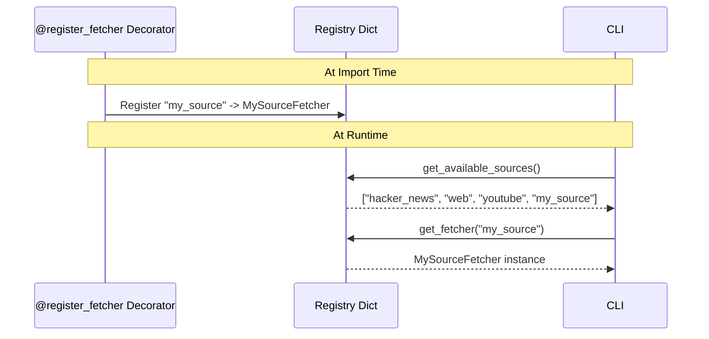

# Developer Guide

This guide covers extending and customizing AI Blogger (Inker) for developers.

## Development Setup

### Prerequisites

- Python 3.9+
- Git
- Virtual environment tool (venv, conda, etc.)

### Setting Up the Development Environment

```bash
# Clone the repository
git clone https://github.com/ianlintner/inker.git
cd inker

# Create and activate virtual environment
python -m venv venv
source venv/bin/activate  # On Windows: venv\Scripts\activate

# Install in development mode with dev dependencies
pip install -e ".[dev]"

# Set up environment variables
export OPENAI_API_KEY="your-key"
export TAVILY_API_KEY="your-key"
export YOUTUBE_API_KEY="your-key"
```

## Project Structure

```
inker/
├── ai_blogger/           # Main package
│   ├── __init__.py       # Package exports
│   ├── __main__.py       # CLI entrypoint
│   ├── chains.py         # LangChain chains
│   ├── config.py         # Configuration
│   ├── fetchers.py       # Fetcher implementations
│   ├── models.py         # Pydantic models
│   └── utils.py          # Utility functions
├── tests/                # Test suite
│   ├── features/         # BDD feature files
│   ├── step_defs/        # Step definitions
│   └── test_ai_blogger.py
├── docs/                 # Documentation
├── pyproject.toml        # Project configuration
├── requirements.txt      # Dependencies
├── Dockerfile            # Container definition
└── mkdocs.yml            # Documentation config
```

## Adding a New Fetcher

The fetcher architecture is designed for easy extension. Follow these steps to add a new news source:

### Step 1: Create the Fetcher Class

```python
# In ai_blogger/fetchers.py or a new module

from typing import List
from ai_blogger.fetchers import BaseFetcher, register_fetcher
from ai_blogger.models import Article

@register_fetcher("my_source")
class MySourceFetcher(BaseFetcher):
    """Fetcher for My Source articles."""
    
    name = "my_source"
    env_key = "MY_SOURCE_API_KEY"  # Set to None if no key needed
    description = "Fetch articles from My Source"
    
    def fetch(self, topic: str, max_results: int) -> List[Article]:
        """Fetch articles from My Source.
        
        Args:
            topic: The topic to search for.
            max_results: Maximum number of results.
            
        Returns:
            List of Article objects.
        """
        # Validate inputs
        self._validate_inputs(topic, max_results)
        
        articles = []
        api_key = os.environ.get(self.env_key)
        
        if not api_key:
            logger.warning(self.get_missing_key_message())
            return articles
        
        try:
            # Your implementation here
            # Make API calls, parse responses, etc.
            
            for item in response_data:
                article = Article(
                    title=item["title"],
                    url=item["url"],
                    source=self.name,
                    summary=item["description"][:500],
                    topic=topic,
                )
                articles.append(article)
                
        except requests.RequestException as e:
            logger.error(f"Error fetching from {self.name}: {e}")
        
        return articles
```

### Step 2: Update Configuration (Optional)

Add default result count for your source:

```python
# In ai_blogger/config.py

SOURCE_DEFAULTS: Dict[str, int] = {
    "hacker_news": 10,
    "web": 5,
    "youtube": 5,
    "my_source": 10,  # Add your source
}
```

### Step 3: Add Tests

```python
# In tests/test_ai_blogger.py

def test_my_source_fetcher():
    """Test that my_source fetcher is registered."""
    from ai_blogger import get_fetcher
    
    fetcher = get_fetcher("my_source")
    assert fetcher is not None
    assert fetcher.name == "my_source"
```

### Registration Flow



## Customizing LLM Chains

### Modifying Prompts

The LangChain chains in `chains.py` use prompt templates that can be customized:

```python
# Example: Custom generator prompt
prompt = ChatPromptTemplate.from_messages([
    ("system", """Your custom system prompt here...
    
    Requirements:
    - Custom requirement 1
    - Custom requirement 2
    """),
    ("human", "{articles}\n\nGenerate {num_candidates} posts."),
])
```

### Adjusting Temperature

Temperature settings affect output creativity:

| Temperature | Effect | Use Case |
|-------------|--------|----------|
| 0.0 - 0.3 | Deterministic | Scoring, evaluation |
| 0.4 - 0.7 | Balanced | Refinement |
| 0.8 - 1.0 | Creative | Content generation |

```python
def get_llm(temperature: float = 0.7) -> ChatOpenAI:
    return ChatOpenAI(model=LLM_MODEL_NAME, temperature=temperature)
```

### Using Different Models

Set the model via environment variable:

```bash
export OPENAI_MODEL="gpt-4-turbo"  # or gpt-4o, gpt-3.5-turbo
```

## Working with Models

### Pydantic Models

All data structures use Pydantic for validation:

```python
from pydantic import BaseModel, HttpUrl
from typing import List, Optional

class Article(BaseModel):
    title: str
    url: HttpUrl
    source: str
    summary: str
    topic: str
    thumbnail: Optional[str] = None

# Usage
article = Article(
    title="My Article",
    url="https://example.com",
    source="web",
    summary="Description...",
    topic="AI",
)

# Serialize to dict/JSON
article.model_dump()
article.model_dump_json()
```

### Extending Models

```python
class ExtendedArticle(Article):
    """Article with additional metadata."""
    
    author: Optional[str] = None
    published_at: Optional[datetime] = None
    read_time: Optional[int] = None
```

## Testing

### Running Tests

```bash
# Run all tests
pytest tests/ -v

# Run with coverage
pytest tests/ -v --cov=ai_blogger --cov-report=html

# Run specific test file
pytest tests/test_ai_blogger.py -v

# Run BDD tests
pytest tests/features/ -v
```

### Writing Tests

```python
import pytest
from ai_blogger import Article, get_fetcher

def test_article_validation():
    """Test that Article model validates correctly."""
    article = Article(
        title="Test",
        url="https://example.com",
        source="test",
        summary="Summary",
        topic="topic",
    )
    assert article.title == "Test"

def test_fetcher_input_validation():
    """Test fetcher validates inputs."""
    fetcher = get_fetcher("hacker_news")
    
    with pytest.raises(ValueError, match="Topic cannot be empty"):
        fetcher._validate_inputs("", 5)
```

### BDD Testing

Feature files in `tests/features/`:

```gherkin
Feature: Hacker News Fetcher
  As a content creator
  I want to fetch articles from Hacker News
  So that I can use them as blog source material

  Scenario: Fetch articles for a topic
    Given a Hacker News fetcher
    When I fetch articles for topic "AI"
    Then I should receive a list of articles
```

## Code Style

### Formatting

The project uses Black and isort for formatting:

```bash
# Format code
black ai_blogger/
isort ai_blogger/

# Check formatting
black --check ai_blogger/
isort --check-only ai_blogger/
```

### Linting

```bash
# Run flake8
flake8 ai_blogger/ --max-line-length=120

# Run mypy
mypy ai_blogger/
```

### Pre-commit Hooks

Consider adding pre-commit hooks:

```yaml
# .pre-commit-config.yaml
repos:
  - repo: https://github.com/psf/black
    rev: 23.12.0
    hooks:
      - id: black
  - repo: https://github.com/pycqa/isort
    rev: 5.13.0
    hooks:
      - id: isort
```

## Configuration Options

### config.py Settings

| Setting | Type | Description |
|---------|------|-------------|
| `TOPICS` | List[str] | Default search topics |
| `SCORING_WEIGHTS` | Dict[str, float] | Criteria weights (must sum to 1.0) |
| `YOUTUBE_MAX_AGE_DAYS` | int | Max age for YouTube videos |
| `DEFAULT_MAX_RESULTS` | int | Default results per source |
| `SOURCE_DEFAULTS` | Dict[str, int] | Per-source result counts |
| `DEFAULT_NUM_CANDIDATES` | int | Number of candidates to generate |
| `DEFAULT_OUTPUT_DIR` | str | Default output directory |
| `LLM_MODEL_NAME` | str | OpenAI model to use |

### Modifying Weights

```python
# In config.py
SCORING_WEIGHTS: Dict[str, float] = {
    "relevance": 0.3,
    "originality": 0.25,
    "depth": 0.2,
    "clarity": 0.15,
    "engagement": 0.1,
}

# Weights are validated at import time
_weights_sum = sum(SCORING_WEIGHTS.values())
if abs(_weights_sum - 1.0) > WEIGHTS_TOLERANCE:
    raise ValueError(f"SCORING_WEIGHTS must sum to 1.0")
```

## Debugging

### Verbose Output

```bash
python -m ai_blogger --verbose
```

### Logging Configuration

```python
import logging
logging.basicConfig(level=logging.DEBUG)
```

### Testing Individual Components

```python
# Test a fetcher
from ai_blogger import get_fetcher

fetcher = get_fetcher("hacker_news")
articles = fetcher.fetch("AI", 5)
for article in articles:
    print(f"- {article.title}")
```

## Best Practices

1. **Error Handling**: Always catch and log exceptions, return empty results on failure
2. **Input Validation**: Use `_validate_inputs()` in fetchers
3. **Type Hints**: Use type annotations throughout
4. **Documentation**: Include docstrings with Args/Returns
5. **Testing**: Write tests for new functionality
6. **API Keys**: Never hardcode keys, use environment variables

## See Also

- [Architecture](architecture.md) - System design overview
- [API Reference](api-reference.md) - Module documentation
- [Contributing](contributing.md) - Contribution guidelines
