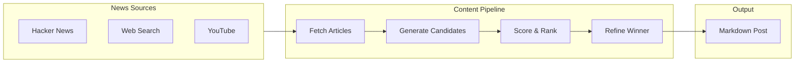

# AI Blogger (Inker)

A LangChain-based automated daily AI blogger that discovers new software-engineering news, generates draft blog posts, scores them, refines the winner, and outputs a final Markdown blog post.

## Overview

AI Blogger (Inker) is designed for **simple CLI execution** and **cron automation**. It leverages multiple news sources and AI-powered content generation to produce high-quality technical blog posts.

## Key Features

- **Modular, extensible architecture** for easy addition of new sources
- **Multi-source news fetching** from Hacker News, Tavily web search, and YouTube
- **Dynamic source selection** via CLI
- **AI-powered content generation** using LangChain and GPT-4
- **Automated scoring and selection** of best content
- **Markdown output** ready for publishing

## Quick Links

| Resource | Description |
|----------|-------------|
| [Getting Started](getting-started.md) | Installation and quick start guide |
| [Architecture](architecture.md) | System design and component overview |
| [Developer Guide](developer-guide.md) | Extending and customizing AI Blogger |
| [API Reference](api-reference.md) | Module and function documentation |
| [Operations](operations.md) | Deployment, monitoring, and troubleshooting |
| [Contributing](contributing.md) | How to contribute to the project |

## Requirements

- **Python 3.9+**
- OpenAI API key (required)
- Tavily API key (optional, for web search)
- YouTube API key (optional, for YouTube trending)

## License

MIT License - see [LICENSE](https://github.com/ianlintner/inker/blob/main/LICENSE) for details.
