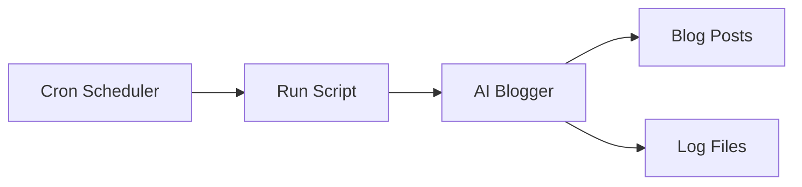
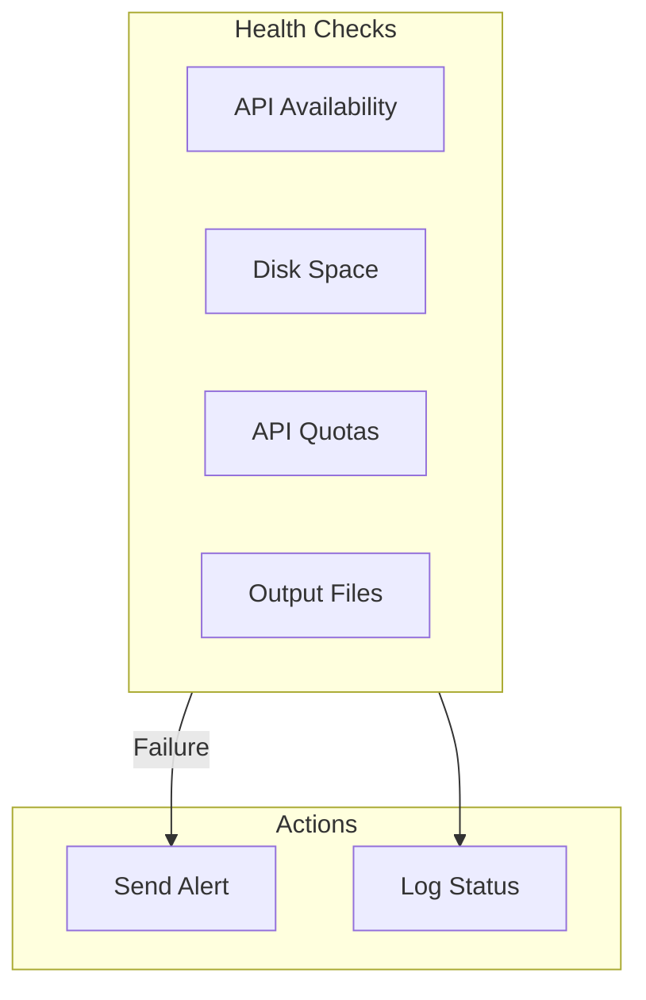
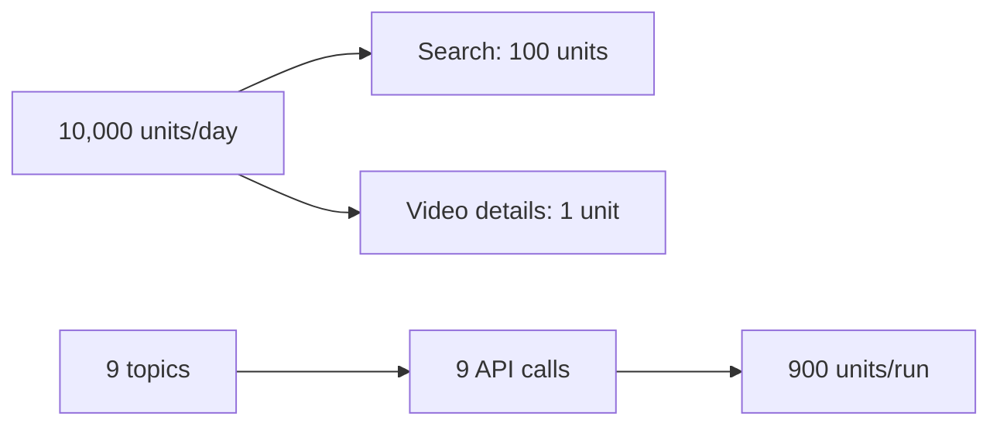

# Operations Guide

This guide covers deployment, automation, monitoring, and troubleshooting for AI Blogger (Inker).

## Deployment Options

### Local Development

```bash
# Clone and setup
git clone https://github.com/ianlintner/inker.git
cd inker
python -m venv venv
source venv/bin/activate
pip install -r requirements.txt

# Configure
export OPENAI_API_KEY="your-key"
export TAVILY_API_KEY="your-key"
export YOUTUBE_API_KEY="your-key"

# Run
python -m ai_blogger
```

### Docker Deployment

```mermaid
flowchart LR
    subgraph Container["Docker Container"]
        APP[AI Blogger]
    end
    
    subgraph Volumes["Volumes"]
        POSTS[/posts volume]
    end
    
    subgraph Secrets["Environment"]
        ENV[API Keys]
    end
    
    ENV --> Container
    Container --> POSTS
```

#### Build and Run

```bash
# Build the image
docker build -t ai-blogger .

# Run with environment variables
docker run --rm \
  -e OPENAI_API_KEY=your-key \
  -e TAVILY_API_KEY=your-key \
  -e YOUTUBE_API_KEY=your-key \
  -v $(pwd)/posts:/app/posts \
  ai-blogger --num-posts 3 --out-dir /app/posts

# Run with custom options
docker run --rm \
  -e OPENAI_API_KEY=your-key \
  -v $(pwd)/posts:/app/posts \
  ai-blogger \
  --sources hacker_news \
  --topics "AI development" \
  --num-posts 2 \
  --out-dir /app/posts
```

#### Docker Compose

```yaml
# docker-compose.yml
version: '3.8'

services:
  ai-blogger:
    build: .
    environment:
      - OPENAI_API_KEY=${OPENAI_API_KEY}
      - TAVILY_API_KEY=${TAVILY_API_KEY}
      - YOUTUBE_API_KEY=${YOUTUBE_API_KEY}
    volumes:
      - ./posts:/app/posts
    command: ["--num-posts", "3", "--out-dir", "/app/posts"]
```

### Kubernetes Deployment

```yaml
# ai-blogger-cronjob.yaml
apiVersion: batch/v1
kind: CronJob
metadata:
  name: ai-blogger
spec:
  schedule: "0 6 * * *"  # Daily at 6 AM
  jobTemplate:
    spec:
      template:
        spec:
          containers:
          - name: ai-blogger
            image: ai-blogger:latest
            args:
              - "--num-posts"
              - "3"
              - "--out-dir"
              - "/app/posts"
            env:
              - name: OPENAI_API_KEY
                valueFrom:
                  secretKeyRef:
                    name: ai-blogger-secrets
                    key: openai-api-key
              - name: TAVILY_API_KEY
                valueFrom:
                  secretKeyRef:
                    name: ai-blogger-secrets
                    key: tavily-api-key
              - name: YOUTUBE_API_KEY
                valueFrom:
                  secretKeyRef:
                    name: ai-blogger-secrets
                    key: youtube-api-key
            volumeMounts:
              - name: posts
                mountPath: /app/posts
          volumes:
            - name: posts
              persistentVolumeClaim:
                claimName: ai-blogger-posts
          restartPolicy: OnFailure
```

## Automation

### Cron Job Setup



#### Basic Cron Job

```bash
# Edit crontab
crontab -e

# Add entry to run daily at 6 AM
0 6 * * * cd /opt/ai-blogger && \
  /opt/ai-blogger/venv/bin/python -m ai_blogger \
  --num-posts 3 --out-dir ./posts \
  >> /var/log/ai-blogger.log 2>&1
```

#### Advanced Cron Script

```bash
#!/bin/bash
# /opt/ai-blogger/run-blogger.sh

set -e

# Configuration
BLOGGER_HOME="/opt/ai-blogger"
VENV_PATH="$BLOGGER_HOME/venv"
OUTPUT_DIR="$BLOGGER_HOME/posts"
LOG_FILE="$BLOGGER_HOME/logs/ai-blogger-$(date +%Y-%m-%d).log"

# Load environment
source "$VENV_PATH/bin/activate"
source "$BLOGGER_HOME/.env"

# Create log directory
mkdir -p "$(dirname "$LOG_FILE")"

# Run AI Blogger
echo "=== Starting AI Blogger at $(date) ===" >> "$LOG_FILE"

python -m ai_blogger \
  --num-posts 3 \
  --out-dir "$OUTPUT_DIR" \
  --verbose \
  >> "$LOG_FILE" 2>&1

STATUS=$?

if [ $STATUS -eq 0 ]; then
    echo "=== Completed successfully at $(date) ===" >> "$LOG_FILE"
else
    echo "=== Failed with status $STATUS at $(date) ===" >> "$LOG_FILE"
    # Optional: Send notification
    # curl -X POST "$SLACK_WEBHOOK" -d '{"text":"AI Blogger failed"}'
fi

exit $STATUS
```

### Systemd Timer

```ini
# /etc/systemd/system/ai-blogger.service
[Unit]
Description=AI Blogger Daily Run
After=network-online.target

[Service]
Type=oneshot
User=blogger
WorkingDirectory=/opt/ai-blogger
Environment="PATH=/opt/ai-blogger/venv/bin"
EnvironmentFile=/opt/ai-blogger/.env
ExecStart=/opt/ai-blogger/venv/bin/python -m ai_blogger --num-posts 3 --out-dir /opt/ai-blogger/posts
StandardOutput=append:/var/log/ai-blogger/output.log
StandardError=append:/var/log/ai-blogger/error.log

[Install]
WantedBy=multi-user.target
```

```ini
# /etc/systemd/system/ai-blogger.timer
[Unit]
Description=Run AI Blogger daily

[Timer]
OnCalendar=*-*-* 06:00:00
Persistent=true

[Install]
WantedBy=timers.target
```

```bash
# Enable and start
sudo systemctl enable ai-blogger.timer
sudo systemctl start ai-blogger.timer

# Check status
sudo systemctl status ai-blogger.timer
sudo systemctl list-timers
```

## Monitoring

### Health Checks



#### Check Script

```bash
#!/bin/bash
# /opt/ai-blogger/health-check.sh

# Check OpenAI API
check_openai() {
    response=$(curl -s -o /dev/null -w "%{http_code}" \
        -H "Authorization: Bearer $OPENAI_API_KEY" \
        "https://api.openai.com/v1/models")
    [ "$response" = "200" ]
}

# Check YouTube API
check_youtube() {
    response=$(curl -s -o /dev/null -w "%{http_code}" \
        "https://www.googleapis.com/youtube/v3/search?key=$YOUTUBE_API_KEY&part=snippet&maxResults=1&q=test")
    [ "$response" = "200" ]
}

# Check disk space
check_disk() {
    available=$(df -BG /opt/ai-blogger/posts | awk 'NR==2 {print $4}' | sed 's/G//')
    [ "$available" -gt 1 ]  # At least 1GB free
}

# Run checks
echo "Running health checks..."

if check_openai; then
    echo "✓ OpenAI API: OK"
else
    echo "✗ OpenAI API: FAILED"
fi

if check_youtube; then
    echo "✓ YouTube API: OK"
else
    echo "✗ YouTube API: FAILED"
fi

if check_disk; then
    echo "✓ Disk Space: OK"
else
    echo "✗ Disk Space: LOW"
fi
```

### Logging

#### Log Rotation

```bash
# /etc/logrotate.d/ai-blogger
/var/log/ai-blogger/*.log {
    daily
    missingok
    rotate 14
    compress
    delaycompress
    notifempty
    create 0644 blogger blogger
}
```

#### Structured Logging

```python
import logging
import json
from datetime import datetime

class JSONFormatter(logging.Formatter):
    def format(self, record):
        return json.dumps({
            "timestamp": datetime.utcnow().isoformat(),
            "level": record.levelname,
            "message": record.getMessage(),
            "module": record.module,
        })

# Configure
handler = logging.StreamHandler()
handler.setFormatter(JSONFormatter())
logging.getLogger().addHandler(handler)
```

### Metrics

Track key metrics for monitoring:

| Metric | Description | Alert Threshold |
|--------|-------------|-----------------|
| `articles_fetched` | Total articles fetched | < 10 per run |
| `candidates_generated` | Blog candidates created | < requested |
| `run_duration` | Total execution time | > 10 minutes |
| `api_errors` | API call failures | > 0 |
| `disk_usage` | Output directory size | > 90% |

## API Rate Limits

### YouTube Data API



- Default quota: 10,000 units/day
- Search request: 100 units
- With 9 topics: ~900 units per run
- Maximum safe runs: ~10/day

### OpenAI API

- Rate limits vary by tier
- Monitor usage in OpenAI dashboard
- Consider using `gpt-3.5-turbo` for lower costs

### Tavily API

- Check your plan limits
- Default is typically 1,000 searches/month

## Troubleshooting

### Common Issues

#### No Articles Found

```
Error: No articles found.
```

**Causes:**

1. Missing API keys
2. Network connectivity issues
3. No results for topics

**Solutions:**

```bash
# Check API key availability
python -m ai_blogger --list-sources

# Verify network
curl -s "https://hn.algolia.com/api/v1/search?query=test"

# Try with verbose output
python -m ai_blogger --verbose
```

#### API Key Issues

```
Warning: YOUTUBE_API_KEY not set - YouTube trending will be disabled
```

**Solutions:**

```bash
# Verify environment variable
echo $YOUTUBE_API_KEY

# Test API directly
curl "https://www.googleapis.com/youtube/v3/search?key=$YOUTUBE_API_KEY&part=snippet&maxResults=1&q=test"
```

#### LLM Parsing Errors

```
Error parsing candidate posts: JSONDecodeError
```

**Causes:**

1. API rate limiting
2. Model response issues
3. Network timeouts

**Solutions:**

```bash
# Try with different model
export OPENAI_MODEL="gpt-3.5-turbo"

# Run with fewer candidates
python -m ai_blogger --num-posts 2
```

#### Disk Space Issues

```bash
# Check available space
df -h /opt/ai-blogger/posts

# Clean old posts
find /opt/ai-blogger/posts -name "*.md" -mtime +30 -delete
```

### Debug Mode

```bash
# Enable verbose logging
python -m ai_blogger --verbose

# Python debug mode
python -v -m ai_blogger

# Full debug with logging
PYTHONPATH=. python -c "
import logging
logging.basicConfig(level=logging.DEBUG)
from ai_blogger import get_fetcher
fetcher = get_fetcher('hacker_news')
articles = fetcher.fetch('AI', 5)
print(f'Found {len(articles)} articles')
"
```

### Log Analysis

```bash
# Check recent logs
tail -f /var/log/ai-blogger.log

# Search for errors
grep -i error /var/log/ai-blogger.log | tail -20

# Count runs by status
grep "SUCCESS\|FAILED" /var/log/ai-blogger.log | sort | uniq -c
```

## Backup and Recovery

### Backup Strategy

```bash
#!/bin/bash
# backup-posts.sh

BACKUP_DIR="/backup/ai-blogger"
POSTS_DIR="/opt/ai-blogger/posts"
DATE=$(date +%Y-%m-%d)

# Create backup
tar -czf "$BACKUP_DIR/posts-$DATE.tar.gz" -C "$POSTS_DIR" .

# Clean old backups (keep 30 days)
find "$BACKUP_DIR" -name "*.tar.gz" -mtime +30 -delete
```

### Recovery

```bash
# Restore from backup
tar -xzf /backup/ai-blogger/posts-2024-01-15.tar.gz -C /opt/ai-blogger/posts
```

## Security Considerations

### API Key Protection

- Never commit API keys to source control
- Use environment files with restricted permissions
- Consider using secret management solutions (Vault, AWS Secrets Manager)

```bash
# Secure .env file
chmod 600 /opt/ai-blogger/.env
chown blogger:blogger /opt/ai-blogger/.env
```

### Container Security

- Run as non-root user
- Use read-only filesystem where possible
- Limit container capabilities

```dockerfile
USER appuser
```

## See Also

- [Architecture](architecture.md) - System design overview
- [Developer Guide](developer-guide.md) - Extension guide
- [Getting Started](getting-started.md) - Quick start guide
